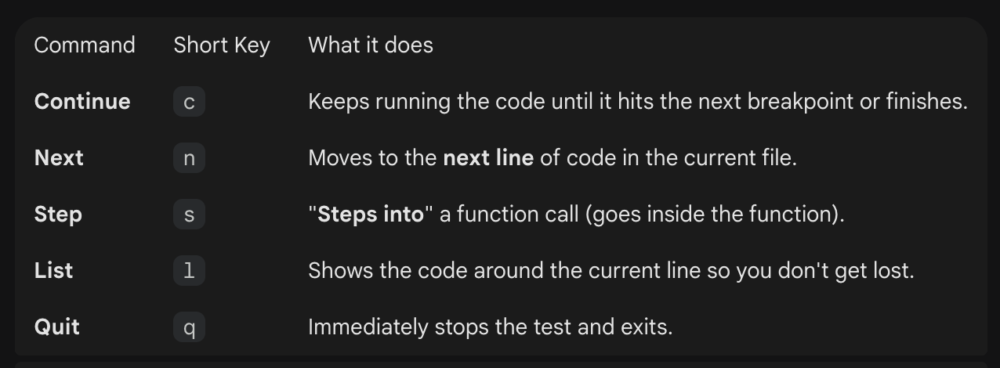

# Aplicacion_Constantec
Repositorio para el desarrollo de la aplicación que gestionará las constancias

### Como crear una imagen de desarrollo de constatec
```shell
Aplicacion_Constantec$ docker build -f ./dockerfiles/Dockerfile.dev -t jeshuarocha/constantec_dev:{VERSION!} -t jeshuarocha/constantec_dev:latest .
```
Nota: modificar la version del docker image

### Como publicar una nueva imagen a docker hub
```shell
Aplicacion_Constantec$ docker push jeshuarocha/constantec_dev:latest
Aplicacion_Constantec$ docker push jeshuarocha/constantec_dev:{VERSION!}
```
Nota: modificar la version del docker image

### Como crear containers para modo desarrollo con docker compose
```shell
Aplicacion_Constantec$ docker compose -f docker-compose-dev.yml up -d
```

### Como el usuario admin
```shell
Aplicacion_Constantec$ docker exec -it constantec-dev /bin/bash
$ ipython
from models.factories import EstudiantesFactory
from models.factories import AdminFactory
from database.connection import SessionLocal
from autenticacion.seguridad import get_password_hash
sesion = SessionLocal()

EstudiantesFactory(no_control="123", nombre="Jeshua", apellidos="Rocha")
EstudiantesFactory(no_control="123", nombre="Jeshua", apellidos="Rocha", contrasena=get_password_hash("passworddiferente"))
AdminFactory(username="admin")
```

## Los contenedores internamente ya tienen instalado ruff, mypy y pre-commit

### Pero si quieres utilizarlo en tu host (computadora), entonces descarga las siguientes herraminetas:

#### Para formater
``` shell
pip install ruff
```
#### Para linter
``` shell
pip install mypy
```
#### Para pre-commit
``` shell
pip install pre-commit
```
#### Para activar el framework pre-commit, el cual al configurar los ganchos (hooks) de Git, se ejecutaran automáticamente.
``` shell
pre-commit install
```

#### Para ejecutar todas las herramientas de validación y formateo que configurarán el proyecto.
``` shell
pre-commit run --all-files
```

## Comandos extra

#### 1. Corrige y organiza imports automáticamente 
``` shell
ruff check . --fix
``` 

#### 2. Da formato estético al código 
``` shell
ruff format .
``` 

#### 3. Verifica que no existan errores de tipos en ninguna tabla 
``` shell
mypy . > errores.txt
``` 

#### Para generar una lista detallada de todos los paquetes de Python instalados en el entorno actual.
``` shell
pip freeze > requirements_dev.txt
```

#### Para preparar la aplicación web en un entorno de producción.
``` shell
npm run build
```

#### Para mover el disco a una carpeta lista para ser empaquetada en el contenedor de docker.
``` shell
mv dist ../api-constantec/web-app
```

### Configurar el Administrador de Versiones de Nodejs y Python

#### 1. Instalar asdf
```shell
~ $ brew install asdf
```

#### 2. Instalar los plugins de nodejs y python
```shell
~ $ asdf plugin add nodejs
~ $ asdf plugin add python
```

#### 3. Instalar las versiones requeridas por los plugins (revisarlas en el archivo .tool-verions)
```shell
~ $ asdf install nodejs 22.16.0
~ $ asdf install python 3.12.10
```

#### 4. Configura las versiones correctas de nodejs y python en tu proyecto
```shell
~ $ asdf install
```

## Pruebas unitarias para el Back-End

#### Instalación de las siguientes librerias para pytest
```shell
pip install httpx pytest-asyncio
pip install pytest
```

#### 1. Entrar al contenedor de constantec-dev
```shell
docker exec -it constantec-dev /bin/bash
```

#### 2. Ejecutar el comando de pytest para observar los detalles de la prueba
```shell
python -m pytest
```

#### 3. Dentro del entorno de pytest se pueden usar los siguientes comandos para debuggear cada breakpoint
